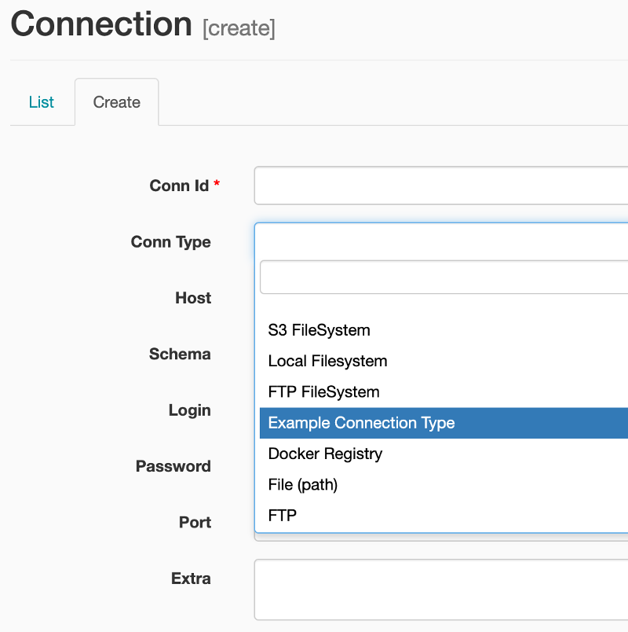

# Airflow Plus


Facade over Airflow that provides a simple typed interface.

- Simple expressive operator definition
- Better composability
- Greatly improved unit testing and debugging

## Simple typed operators
You can define operators in Airflow Plus by implementing the Operator protocol. Minimalist code by making them into a dataclass.

```python
class HelloWorldOperator(Operator):
    task_id: str
    msg: str = 'Hello World!'

    def execute(self, dag_context: DAGContext):
        print(self.msg)
        print(dag_context.ds)
```

Typed API means better discoverability. No need to check the docs to find out what is in the context, just get code complete/Intellisense from your editor.

## Debugging
Simple debugging in your editor with breakpoints by doing:

```python
op = HelloWorldOperator(task_id='test_op')
op.test()
```

## Easy Custom Hooks

```python
class ExampleHook(CustomBaseHook):
    conn_type = 'example'
    conn_type_long = 'Example Connection Type'

    # Can be initialised without using the Airflow DB. Useful for testing
    def __init__(self, conn_params: Connection):
        self.conn_id = conn_params.conn_id
        self.message = conn_params.extra_dejson['message']

    def print_message(self):
        print(self.message)
```

We can initialise this hook from its connection id by doing
```python
ExampleHook.from_conn_id('my_example_conn')
```

But we usually won't need to as we will see in the following sections.

## Modified UI

If you run the webserver with our CLI, the custom connection types will appear in the interface

```bash
afp webserver
```



Magic!!!

## Resolving hooks

Airflow Plus operators resolve connection ids to their corresponding hook, using their connection type (yes, even custom hooks). This simplifies operator definition and frees us from needing to hard code they hook type.

This simple change enables us to write extremely concise and reusable code. Example:

```python
@dataclass
class DatabaseToFileSystem(Operator):
    template_fields = ('sql', 'path')
    template_ext = ('.sql',)

    task_id: str
    db_hook: DbApiHook
    sql: str
    fs_hook: FileSystemHook
    path: str
    format: FileFormat = FileFormat.CSV

    def execute(self, dag_context: DAGContext):
        df = self.db_hook.get_pandas_df(self.sql)
        data = self.format.convert_from_dataframe(df)
        self.fs_hook.write_data(self.path, data)
```

We don't need to pass the hook, we can (and should) pass a connection id string instead.

```python
op = DatabaseToFileSystem(
    task_id='testing_db_to_fs',
    db_hook='source_database',
    sql='SELECT * FROM stocks',
    fs_hook='data_lake',
    path='dumps/{{ ds }}/stocks.csv'
)
```

With this extremely simple definition we just defined an operator that can read from any database (as long as it has a DbApi hook) and write the CSV output to any filesystem (as long as it has a FileSystem hook). This means that we can read from Postgres and write to S3, read from MariaDB and write to FTP, read from SQLite and write to a local file or any combination. The best part is we don't need to change the code, as long as the connection has the right type it will create the right hook.

## Unit testing

We can unit test operators by using the `mock_airflow_database` context manager. This creates a temporary sqlite database and makes airflow point to it for the duration of the context manager. This lets us add variables and connections that will only exist for our test, without polluting our airflow database.

Lets demonstrate this by testing the previously defined `DatabaseToFileSystem` operator. In order to do this we will make the db_hook be a `SqlLite` hook and the fs_hook a `FileSystemHook`.

```python
def test_database_to_filesystem_operator(tmp_sqlite, tmp_path):
    with mock_airflow_db() as af_db:
        print(f'Adding sqlite connection...')
        af_db.set_connection(
            conn_id='source_database',
            conn_type='sqlite',
            host=tmp_sqlite,
        )
        print(f'Adding data lake connection with base path {tmp_path}...')
        af_db.set_connection(
            conn_id='data_lake',
            conn_type='local_filesystem',
            extra={
                'base_path': str(tmp_path)
            }
        )

        op = DatabaseToFileSystem(
            task_id='testing_db_to_fs',
            db_hook='source_database',
            sql='SELECT * FROM stocks',
            fs_hook='data_lake',
            path='dumps/{{ ds }}/stocks.csv'
        )

        op.test(execution_date=datetime(2020, 2, 18), airflow_db=af_db)
        assert (tmp_path / 'dumps/2020-02-18/stocks.csv').read_text().strip() == """\
date,trans,symbol,qty,price
2006-01-05,BUY,RHAR,11.0,35.14
2006-03-28,BUY,IBM,1000.0,45.0
2006-04-05,BUY,MSFT,1000.0,72.0
2006-04-06,SELL,IBM,500.0,53.0"""
```

With a few lines of code we defined a unit test that:
- Creates a temporary clean airflow database.
- Adds the connection `source_database` with connection type `sqlite`, which is an `SqliteOperator` (standard Airflow one).
- Adds the connection `data_lake` with connection type `local_filesystem`, which is a `LocalFSHook` (provided by Airflow Plus).
- Instantiates the operator with the previously defined connection IDs.
- Runs the operator, which renders the `sql` and `path` fields, queries the database, transforms the result to a CSV and writes it to a local path.
- Checks that the written CSV is the one we expected.

For the sake of completeness, this test was using the following fixture to create and populate the test database:

```python
@fixture
def tmp_sqlite(tmp_path):
    sqlite_db = str(tmp_path / 'test.db')
    with closing(sqlite3.connect(sqlite_db)) as conn, closing(conn.cursor()) as cursor:
        cursor.execute('CREATE TABLE stocks (date text, trans text, symbol text, qty real, price real)')
        insert_query = 'INSERT INTO stocks VALUES (?,?,?,?,?)'
        insert_queries_params = [
            ('2006-01-05', 'BUY', 'RHAR', 11, 35.14),
            ('2006-03-28', 'BUY', 'IBM', 1000, 45.00),
            ('2006-04-05', 'BUY', 'MSFT', 1000, 72.00),
            ('2006-04-06', 'SELL', 'IBM', 500, 53.00),
        ]
        for params in insert_queries_params:
            cursor.execute(insert_query, params)
        conn.commit()
    print(f'Initialised test SQLite db in {sqlite_db}')
    yield sqlite_db

```
